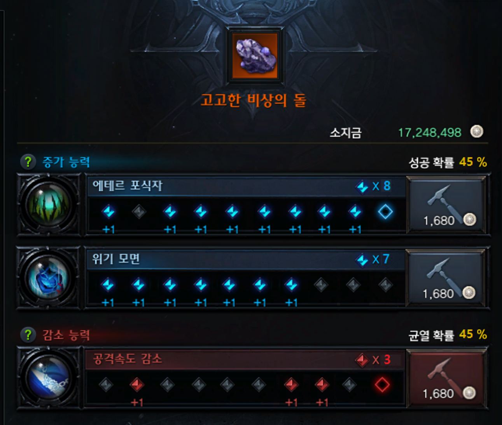

# LostARK Stone Helper

# ✨ 프로젝트 개요

- **프로젝트 이름**

    로스트아크 스톤 헬퍼(LostARK Stone Helper)

- **프로젝트의 목표**

    로스트아크에는 '어빌리티 스톤'이라는 아이템이 있으며, 이는 세공을 통해 각인을 활성화합니다. 어빌리티 스톤 1개당 일정한 세공 횟수가 제공되며, 특정 확률에 따라 세공 단계의 성공, 실패 여부가 결정됩니다. 또한, 세공의 성공과 실패 여부에 따라 확률이 변화하는데, 이때 어떤 선택을 해야 가장 많이 성공할 수 있을지 파악하고 사용자에게 알려주는 GUI APP을 개발하는 것이 목표입니다.

# 📝 개발 계획

- **데이터셋 구축**

    세공 시 각인과 세공 진행 상황을 표시하는 UI의 위치를 인식하기 위한 BBox Labeling 데이터셋 구축이 필요.

- **세공 UI 인식 (ObjectDetection)**

    세공 UI 위치를 인식하기 위한 ObjectDetection 모델 학습이 필요. UI는 형태나 크기가 변하지 않으므로 복잡한 모델보다 단순하고 빠른 모델이 필요.

- **세공 선택 추천 알고리즘**

    현재 어빌리티 스톤 상태에서 어떤 선택을 해야 가장 많은 성공 혹은 목표 단계를 달성할 수 있을 지 계산하여 추천해 주는 알고리즘이 필요.

# 🎨 시스템 아키텍쳐 및 디자인

- **시스템 아키텍쳐**

    

- **App 디자인**

    

# 🛠️ 프로젝트 수행 절차 및 방법

- **데이터셋 구축**

    🤔 **Problem**

    1. 어빌리티 스톤 상태 인식을 위해 UI 부분을 BBox 형태의 Labeling이 필요.
    - 시간이 너무 많이 소요됨
    2. 다양한 각인과 세공 상태의 데이터가 필요.
    - 인게임 재화뿐만 아니라 유료 재화도 소모됨

    💡 **Solution**

    일반적인 ObjectDection과 다르게 UI의 위치(각인, 세공 상태)는 상대적으로 위치가 고정되어 있고 크기 및 형태 변화가 없음.
    따라서 아이콘 부분만 추출하여 이미지 합성을 통해 대량의 데이터를 생성할 수 있고, 이미지를 생성하면서 Label도 동시에 생성할 수 있음.

- **세공 UI 인식 (ObjectDetection)**

    🤔 **Problem**

    1. GUI App으로 제공하기 위해서 QT 프로그래밍 필요
    2. 인식된 어빌리티 스톤 상태를 App에 표시

    💡 **Solution**

    PyQt6를 이용한 GUI App 개발
    인식된 상태를 App에 표시

- **세공 선택 추천 알고리즘**

    🤔 **Problem**

    1. 어빌리티 스톤 세공을 진행하면 세공의 성공, 실패 여부에 따라 다음 세공의 확률이 변함

    💡 **Solution**

    현재 어빌리티 스톤의 상태를 다음과 같이 표현하고
    (1각인 활성화 수, 1각인 세공횟수, 2각인 활성화 수, 2각인 세공횟수, 3각인 활성화 수, 3각인 세공횟수, 현재 세공 성공 확률)
    세공이 1번 남은 (8, 9, 7, 10, 3, 10, 45) 이런 상태의 어빌리티 스톤이 있을 때 1각인 9, 2각인 7인 스톤을 만들 확률은 45% 이다.

    또한 세공이 2번 남은 (8, 9, 7, 10, 3, 9, 55) 이런 상태의 어빌리티 스톤이 있을 때 1각인 9, 2각인 7인 스톤을 만들 확률은 다음과 같다.
    • 1각인을 선택했을 때
       현재 세공 성공 확률 * (9, 10, 7, 10, 3, 9, 45)의 스톤을 97을 만들 확률
        +
        (1 - 현재 세공 성공 확률) * (8, 10, 7, 10, 3, 9, 65)의 스톤을 97을 만들 확률
        = 0.55 * 1 + 0.45 * 0 = 0.55
    • 3각인을 선택했을 때
       현재 세공 성공 확률 * (8, 9, 7, 10, 4, 10, 45)의 스톤을 97을 만들 확률
        +
        (1 - 현재 세공 성공 확률) * (8, 9, 7, 10, 3, 10, 65)의 스톤을 97을 만들 확률
        = 0.55 * 0.45 + 0.45 * 0.65 = 0.54

    따라서 위의 경우는 1각인 세공을 추천하게 되고 세공이 n번 남은 스톤의 확률로 세공이 n+1번 남은 스톤의 확률을 구할 수 있다.

# 🧪 테스트

- **인게임 테스트**

[https://youtu.be/ja5Wits3r8E](https://youtu.be/ja5Wits3r8E)

❗영상이 안 보인다면 [링크](https://youtu.be/ja5Wits3r8E)를 눌러주세요!
